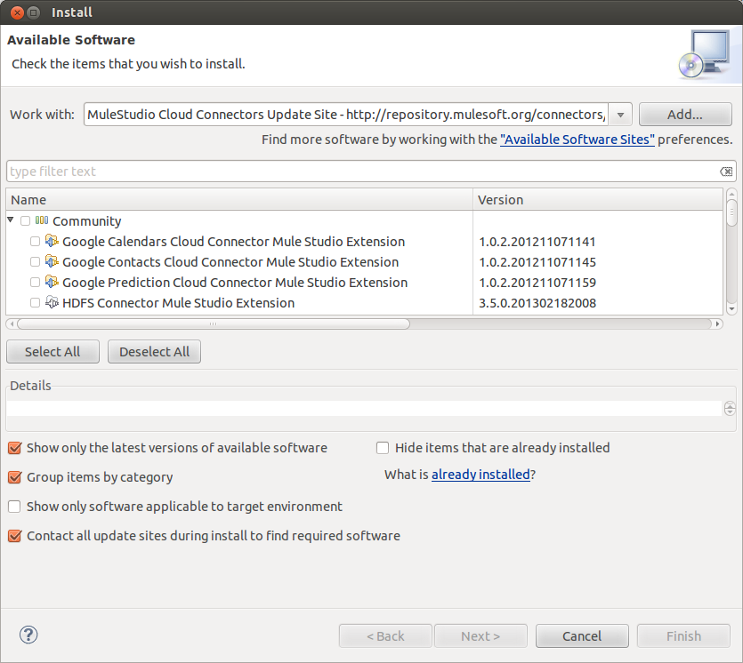
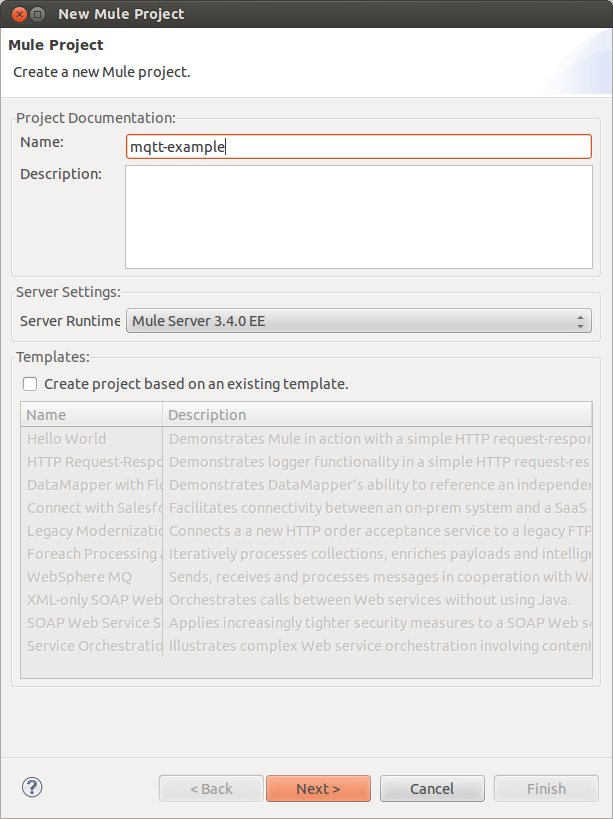
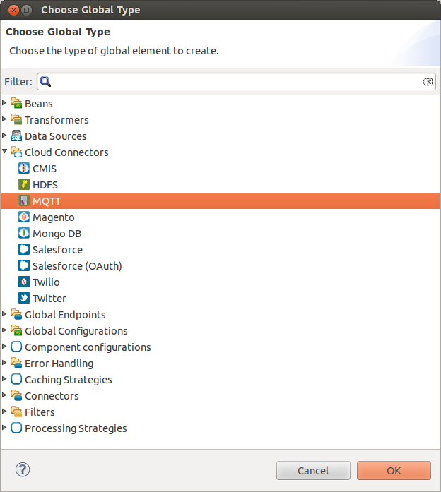
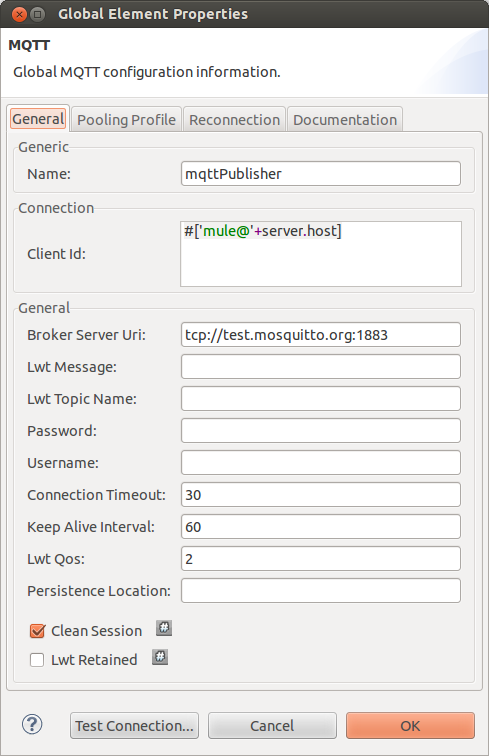
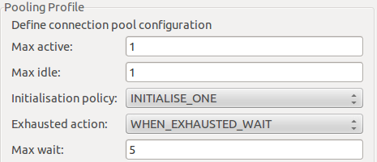
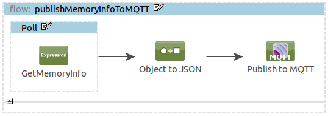
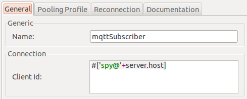
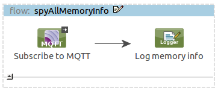

# Mule Sample: Integrating with MQTT

## Purpose

In this sample, we'll learn how to publish data to an MQTT topic and how to subscribe to this topic.
More precisely, we're going to broadcast our Mule's JVM memory information to a topic named `/mule/info/memory/${server.host}`,
where `${server.host}` will be Mule's host name.
We will subscribe to all topics below `/mule/info/memory` so we'll be able to get memory information from all the Mules running this sample.
We will use a (free and public test broker that the Mosquitto project maintains)[http://test.mosquitto.org/].

## Prerequisites

In order to follow this sample walk-through you'll need:

- A basic understanding of MQTT. Refer this (protocol's documentation)[http://mqtt.org/documentation] if need be.
- A working installation of a recent version of [Mule Studio](http://www.mulesoft.org/download-mule-esb-community-edition).

## Building the sample application

### Getting Mule Studio Ready

The MQTT Connector doesn't come bundled with Mule Studio so we have to install it first. For this, we have to do the following:

1. Open Mule Studio and from "Help" menu select "Install New Software...". The installation dialog - shown below - opens.
2. From "Work with" drop down, select "MuleStudio Cloud Connectors Update Site". The list of available connectors will be shown to you.
3. Find and select the MQTT connector in the list of available connectors, the tree structure that is shown.
A faster way to find a specific connector is to filter the list by typing the name of the connector in the input box above the list.
You can choose more than one connector to be installed at once.
4. When you are done selecting the MQTT connector, click on "Next" button.
Installation details are shown on the next page.
Click on "Next" button again and accept the terms of the license agreement.
5. Click on "Finish" button. The MQTT connector is downloaded and installed onto Studio.
You'll need to restart the Studio for the installation to be completed.

### Setting up the project

Now that we've got Mule Studio up and running, it's time to work on the Mule Application.
Create a new Mule Project by clicking on "File > New > Mule Project".
In the new project dialog box, the only thing you are required to enter is the name of the project.
You can click on "Next" to go through the rest of pages.

The first thing to do in our new application is to configure the connection to the test MQTT broker that's listening at `tcp://test.mosquitto.org:1883`.

For this, in the message flow editor, click on "Global Elements" tab on the bottom of the page.
Then click on "Create" button on the top right of the tab.
In the "Choose Global Element" type dialog box that opens select "MQTT" under "Cloud Connectors" and click OK.

In the MQTT configuration dialog box that follows, you need to enter the following information:

- On the "General" tab, enter a name for your configuration settings such as "mqttPublisher"
- In the "Client ID" field, enter an expression that will generate a unique ID for your MQTT connection, for example: `#['mule@'+server.host]`
- In "Broker Server Uri" field, enter: `tcp://test.mosquitto.org:1883`

In the pooling profile tab of this dialog, enter the following:

You are done with the configuration. Click "OK" to close the dialog box.

The XML for the global element should look like this:

    <mqtt:config name="mqttPublisher" clientId="#['mule@'+server.host]"
        brokerServerUri="tcp://test.mosquitto.org:1883" doc:name="MQTT">
        <mqtt:connection-pooling-profile
            initialisationPolicy="INITIALISE_ONE" exhaustedAction="WHEN_EXHAUSTED_WAIT"
            maxActive="1" maxIdle="1"/>
    </mqtt:config>

### Building the MQTT publisher flow

It's time to start building the flow that gathers the JVM memory information and publishes it over MQTT.
Start by dropping a `Poll` element and configure it to poll every 10000 milliseconds (ie 10 seconds).
Drop an expression component in it and enter this expression:

    message.payload = [
        'freeMemory':Runtime.runtime.freeMemory(),
        'maxMemory':Runtime.runtime.maxMemory(),
        'totalMemory':Runtime.runtime.totalMemory()
    ];

Then add an "Object to JSON" transformer in the flow, followed by an MQTT Cloud connector.
Edit the MQTT Cloud connector, select the `Publish` operation and the "mqttPublisher" configuration reference, and enter this topic name: `/mule/info/memory/#[server.host]`

The MQTT publisher flow is ready and should look like:

### Building the MQTT subscriber flow

We would like to listen to all the topics under this root `/mule/info/memory` in order to spy a little on the memory configuration of the Mules out there!
We can't use the same client ID when connecting as a subscriber so we'll create a second global configuration entry.
Follow the same steps as above but this time using the following global parameters:

The XML for the second global element should look like this:

    <mqtt:config name="mqttSubscriber" clientId="#['spy@'+server.host]"
        brokerServerUri="tcp://test.mosquitto.org:1883" doc:name="MQTT">
        <mqtt:connection-pooling-profile
            initialisationPolicy="INITIALISE_ONE" exhaustedAction="WHEN_EXHAUSTED_WAIT"
            maxActive="1" maxIdle="1"/>
    </mqtt:config>

We can now build a second flow that does the spying work for us!
Start by dropping an MQTT Cloud connector in a new flow.
Edit the MQTT Cloud connector, select the `Subscribe` operation and the "mqttSubscriber" configuration reference, and enter this topic filter: `/mule/info/memory/#`

Add a Logger next and configure its category to `mqtt.spy` and message to `#[message.inboundProperties['mqtt.topicName']] #[message.payloadAs(java.lang.String)]`

The MQTT publisher flow is now ready and should look like:

### Flow XML

The final flow XML should look like this.

    <?xml version="1.0" encoding="UTF-8"?>
    <mule xmlns:json="http://www.mulesoft.org/schema/mule/json" xmlns:mqtt="http://www.mulesoft.org/schema/mule/mqtt"
        xmlns:tracking="http://www.mulesoft.org/schema/mule/ee/tracking" xmlns="http://www.mulesoft.org/schema/mule/core"
        xmlns:doc="http://www.mulesoft.org/schema/mule/documentation" xmlns:spring="http://www.springframework.org/schema/beans"
        version="EE-3.4.0" xmlns:xsi="http://www.w3.org/2001/XMLSchema-instance"
        xsi:schemaLocation="
                http://www.springframework.org/schema/beans http://www.springframework.org/schema/beans/spring-beans-current.xsd
                http://www.mulesoft.org/schema/mule/core http://www.mulesoft.org/schema/mule/core/current/mule.xsd
                http://www.mulesoft.org/schema/mule/ee/tracking http://www.mulesoft.org/schema/mule/ee/tracking/current/mule-tracking-ee.xsd
                http://www.mulesoft.org/schema/mule/mqtt http://www.mulesoft.org/schema/mule/mqtt/1.0/mule-mqtt.xsd
                http://www.mulesoft.org/schema/mule/json http://www.mulesoft.org/schema/mule/json/current/mule-json.xsd">
    
        <mqtt:config name="mqttPublisher" clientId="#['mule@'+server.host]"
            brokerServerUri="tcp://test.mosquitto.org:1883" doc:name="MQTT">
            <mqtt:connection-pooling-profile
                initialisationPolicy="INITIALISE_ONE" exhaustedAction="WHEN_EXHAUSTED_WAIT"
                maxActive="1" maxIdle="1"/>
        </mqtt:config>
    
        <mqtt:config name="mqttSubscriber" clientId="#['spy@'+server.host]"
            brokerServerUri="tcp://test.mosquitto.org:1883" doc:name="MQTT">
            <mqtt:connection-pooling-profile
                initialisationPolicy="INITIALISE_ONE" exhaustedAction="WHEN_EXHAUSTED_WAIT"
                maxActive="1" maxIdle="1"/>
        </mqtt:config>
    
        <flow name="publishMemoryInfoToMQTT" doc:name="publishMemoryInfoToMQTT">
            <poll frequency="10000" doc:name="Poll">
                <expression-component doc:name="GetMemoryInfo"><![CDATA[
                message.payload = [
                  'freeMemory':Runtime.runtime.freeMemory(),
                  'maxMemory':Runtime.runtime.maxMemory(),
                  'totalMemory':Runtime.runtime.totalMemory()
                ];]]></expression-component>
            </poll>
            <json:object-to-json-transformer doc:name="Object to JSON" />
            <mqtt:publish config-ref="mqttPublisher" topicName="/mule/info/memory/#[server.host]"
                doc:name="Publish to MQTT" />
        </flow>
        <flow name="spyAllMemoryInfo" doc:name="spyAllMemoryInfo">
            <mqtt:subscribe config-ref="mqttSubscriber" topicFilter="/mule/info/memory/#"
                doc:name="Subscribe to MQTT" />
            <logger category="mqtt.spy"
                message="#[message.inboundProperties['mqtt.topicName']] #[message.payloadAs(java.lang.String)]"
                level="INFO" doc:name="Log memory info" />
        </flow>
    </mule>

### Testing the application

Now it's time to test the application.
Run the application in Mule Studio using `Run As > Mule Application` and watch the logs.
You should see entries similar to:

    INFO  2013-05-15 16:05:27,222 [[mqtt-example].spyAllMemoryInfo.stage1.02] mqtt.spy: /mule/info/memory/pegasus {"freeMemory":160643536,"maxMemory":954466304,"totalMemory":188874752}
    INFO  2013-05-15 16:05:36,768 [[mqtt-example].spyAllMemoryInfo.stage1.02] mqtt.spy: /mule/info/memory/pegasus {"freeMemory":136315512,"maxMemory":954466304,"totalMemory":188874752}

## Other resources

For more information on:

- MQTT Connector, please visit http://mulesoft.github.io/mule-module-mqtt
- Mule AnyPoint® connectors, please visit http://www.mulesoft.org/extensions
- Mule platform and how to build Mule applications, please visit  http://www.mulesoft.org/documentation/display/current/Home
